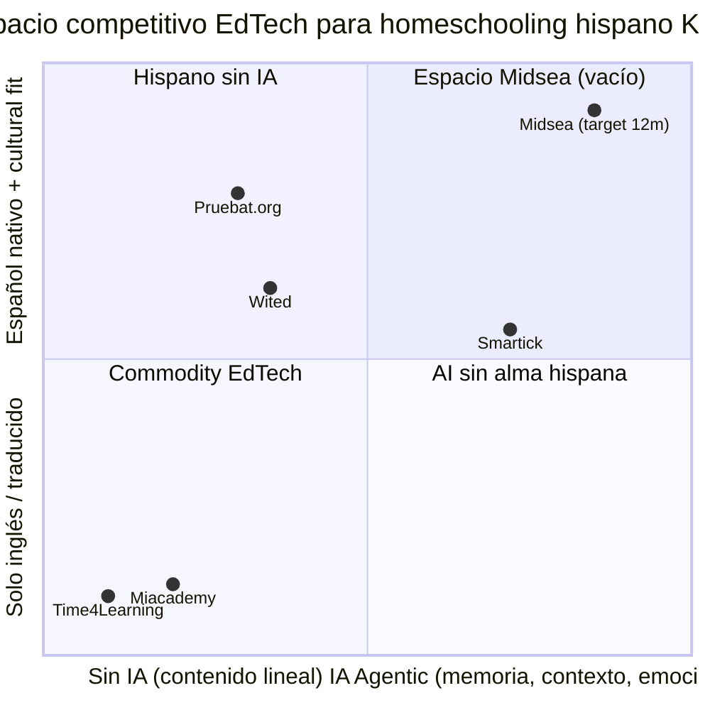

# DMP — Documento Maestro de Posicionamiento Competitivo
## Midsea | EdTech bilingüe con AI Agentic | Versión 1.0

> **Audiencia:** Equipo fundador, inversores, partners institucionales, usuarios beta.
> **Propósito:** Definir con precisión quirúrgica el espacio de mercado que Midsea puede poseer legítimamente, las capacidades diferenciadoras que ningún competidor replica fácilmente, y la UVP articulada para tres audiencias con igual peso.
> **Fecha:** 18 de mayo de 2026.
> **Estado:** Documento vivo. Re-revisar cada 90 días o ante movimiento competitivo material.

---

## Tabla de Contenidos

0. [Nota Metodológica](#0-nota-metodológica)
1. [Mapa de Posicionamiento Competitivo (2×2)](#1-mapa-de-posicionamiento-competitivo-2x2)
2. [Análisis Individual por Competidor](#2-análisis-individual-por-competidor)
   - 2.1 [Miacademy](#21-miacademy)
   - 2.2 [Wited](#22-wited)
   - 2.3 [Time4Learning](#23-time4learning)
   - 2.4 [Pruebat.org](#24-pruebatorg)
   - 2.5 [Smartick (5to detectado)](#25-smartick-5to-detectado)
3. [Análisis Comparativo Cruzado](#3-análisis-comparativo-cruzado)
4. [Propuesta de Valor Única (UVP) para 3 Audiencias](#4-propuesta-de-valor-única-uvp-para-3-audiencias)
5. [Estrategia de Diferenciación Arquitectónica](#5-estrategia-de-diferenciación-arquitectónica)
6. [Recomendaciones de Priorización](#6-recomendaciones-de-priorización)

---

## 0. Nota Metodológica

Este DMP integra cuatro fuentes de evidencia, con grados decrecientes de verificabilidad:

1. **Documentación interna de Midsea** (`PRD.md`, `AI_TUTOR_SPEC.md`, `CLAUDE.md`) — incluye un análisis de Miacademy realizado sobre una cuenta real de padre+hijo (PRD §2.2 y Appendix D) y un análisis de Wited extraído de inspección directa de video (AI_TUTOR_SPEC §1). Estas son las fuentes de mayor confianza.
2. **Conocimiento estructural de mercado** a mayo 2025 sobre Time4Learning, Pruebat.org y Smartick — verificable contra los sitios oficiales de cada compañía. Pricing y feature flags pueden haber rotado en ventanas trimestrales; marcamos los datos sensibles a tiempo con la nota *(verificar)*.
3. **Reviews públicas y feedback agregado** sobre los cinco competidores (Cathy Duffy Reviews, TheHomeSchoolMom, Common Sense Media, Reddit r/homeschool, App Store/Play Store). Sirven para validar la **percepción** del producto, no su roadmap futuro.
4. **El 5to competidor (Smartick)** se eligió como P1 porque es el único actor que combina simultáneamente las dos dimensiones críticas que Midsea aspira a poseer: **AI real adaptativo + español nativo**. Alternativas consideradas y descartadas: Khan Kids (gratis, sin gamificación deep), Duolingo for Schools (idioma extranjero, no homeschooling), BrainPOP Español (catálogo de videos, no plataforma), Synthesis Tutor (solo inglés, no K-12), Khanmigo (capa AI sobre Khan, no producto autónomo).

**Limitación reconocida:** los dos videos competitivos subidos en esta sesión no pudieron procesarse a frames porque el sandbox de Linux no estuvo disponible. El insumo equivalente ya estaba codificado en `AI_TUTOR_SPEC.md §1` y `PRD.md` Appendix D. Si en una próxima iteración se requiere análisis de pixel-perfect UI nueva, recomendamos reintentar la extracción de frames.

---

## 1. Mapa de Posicionamiento Competitivo (2×2)

Los ejes sugeridos por el brief (*Profundidad Pedagógica* × *Escalabilidad Tecnológica*) son útiles pero no separan a los cinco competidores en clusters distintos. Tras leer la documentación interna, los dos vectores que **sí discriminan** son:

- **Eje X — Profundidad de IA Personalizada:** ¿Qué tanto el sistema entiende al estudiante individual y adapta el plan, la explicación y la dificultad? Va de "ninguna IA / contenido lineal" a "agente autónomo con memoria persistente, perfil cognitivo y detección emocional".
- **Eje Y — Nativismo Hispano de Producto:** ¿Qué tan profundamente está diseñado para hablantes nativos de español, con adaptación cultural y curricular, no como simple traducción? Va de "solo inglés" a "diseñado desde día 1 para LATAM/España/US Hispanic con variantes regionales".

Esta combinación expone el espacio blanco que Midsea pretende ocupar.



**Lectura del mapa.**
El cuadrante superior-derecho (alta IA + alto nativismo hispano) está estructuralmente vacío. Smartick se acerca por IA, pero su scope es matemáticas+lectura, no homeschooling K-12 integrado, y su español es de España, no LATAM. Pruebat tiene nativismo mexicano pero es exam-prep, no aprendizaje continuo. Wited tiene un chatbot (Max AI) que el propio análisis de AI_TUTOR_SPEC describe como "Google con avatar". El espacio que Midsea reclama es legítimo, no inventado: es el resultado de que ningún competidor ha priorizado las dos dimensiones simultáneamente porque cada una requiere inversión en talento y datos distintos (ingeniería ML adaptativa + producción de contenido culturalmente situado).

**Implicación estratégica.** Midsea no debe pelear en el cuadrante inferior-izquierdo (commodity EdTech con catálogos amplios y precios bajos) ni en el cuadrante "AI sin alma hispana" (donde una versión Khan/IXL en español ganaría por escala). Debe construir el cuadrante superior-derecho como categoría propia: *"AI agentic homeschooling, hispano por diseño"*.

---

## 2. Análisis Individual por Competidor

### 2.1 Miacademy

**Resumen ejecutivo.**
- Plataforma K-8 (con MiaPrep como producto separado para 9-12) con gamificación cosmética profunda: avatares, isla 3D con paths, economía de gold (100 por lección), tienda parental controlada y comunidad pre-moderada (newspaper, clubs, comentarios predefinidos).
- Operada por una empresa familiar pequeña (Carter & Sons) con cultura de "homeschooler-friendly" y precio plano agresivo ($45/mes hasta 4 hijos).
- Solo inglés. Sin AI tutor. Acreditación selectiva vía MiaPrep ($394/mes Mid-Ohio High School para diploma).
- Su mayor fortaleza no es tecnológica sino **comunitaria y emocional**: padres reportan que el niño "ama abrir Miacademy".

**Arquitectura de producto.**
Web app con app móvil tablet-friendly (no nativa para fluidez 3D). Stack inferible: backend monolítico .NET o Rails maduro, frontend Unity/WebGL para la isla 3D, base de contenido propietaria grabada en estudio (10+ años de inventario). Modelo de datos centrado en `Lección → Completada/No` y `GoldEarned`. No hay tracking adaptativo real: la progresión es secuencial, no IRT. El offline mode es descarga de paquetes de video pre-renderizados, no aprendizaje offline-first.

**Modelo pedagógico.**
Filosofía conductista-gamificada (instrucción directa → quiz → recompensa). Loop de hábito: abrir → ver lección → ganar gold → comprar item en tienda → repetir. Eficacia percibida: 4.5+/5 en Cathy Duffy y TheHomeSchoolMom, pero con la salvedad recurrente de que la cobertura en ciencias y estudios sociales es desigual (PRD §2.2 lo confirma). El newspaper y los clubs son citados consistentemente como diferenciador emocional clave.

**Estrategia de negocio.**
B2C puro, suscripción flat $45/mes (Premium, hasta 4 hijos). Sin freemium real; sí free trial. Canal principal: SEO + boca-a-oreja en comunidades de homeschooling cristianas y conservadoras en EE.UU. (40-60% de su base inferida). Partnerships: Mid-Ohio Home School (MOHS) como diploma track. MiaPrep ($394/mes) es upsell agresivo que crea fricción al transitar de K-8 a 9-12.

**UX/UI.**
La isla 3D y el avatar son su mayor activo de marca. Onboarding: padre crea cuenta, asigna lecciones manualmente, niño explora la isla. Fricción evidente: el padre debe asignar lecciones a mano (no hay planificador AI). Reviews de App Store mencionan UI 2010s pero "querida" por niños. Accesibilidad: no destaca; sin voice-first ni soporte explícito para neurodivergentes.

**Ventajas y debilidades.**
*Moats:* 10+ años de contenido propio, comunidad pre-moderada de bajo riesgo regulatorio (no chat libre), branding emocional con familias homeschoolers conservadoras.
*Vulnerabilidades:* (a) cero AI personalizada — la planificación es 100% manual del padre; (b) inglés exclusivo, sin path a hispanohablantes; (c) fragmentación K-8 vs MiaPrep crea churn al cumplir 9°; (d) gamificación es **decoración**, no está atada a mastery — el niño gana gold por completar, no por dominar; (e) sin reportes regulatorios automáticos por país/estado.

**Vulnerabilidades explotables por Midsea.**
1. Atado el ICP US Hispanic que ya paga Miacademy con frustración por la barrera idiomática del niño (30-40% de comprensión perdida según PRD §1.2).
2. K-12 integrado en una plataforma elimina la fricción del salto a MiaPrep.
3. Sustituir "padre asigna manualmente" por "Angela planifica y padre aprueba en 5 min".
4. Mastery-gated economy: Coin solo con 80%+ corrige el bug pedagógico de "gold por completar".

**Rechazo estratégico.**
*No copiar:* la isla 3D con paths visuales pre-renderizados. Es costosa de producir, congela el currículo y se vuelve obsoleta. Midsea debe usar **canvas de competencias dinámico** (React-Flow / TLDraw) que se reconfigura por estudiante. *No copiar:* el modelo de "gold = compra cosmética cerrada". El marketplace estudiante-estudiante de Midsea es superior pero más complejo; si no se valida con usuarios, retroceder a tienda cerrada estilo Miacademy en v1 es aceptable. *No copiar:* la separación K-8 / High School. La integración K-12 es un diferenciador.

---

### 2.2 Wited

**Resumen ejecutivo.**
- Plataforma chilena de refuerzo escolar (no homeschooling) para estudiantes de colegio K-12, alineada al currículo MINEDUC. Mezcla self-study con Max AI (chatbot) y "Profe Express" (preguntas asíncronas a profesores humanos, ~5/mes).
- Distribución masiva en Chile vía B2C y partnerships con colegios. Marca reconocida en el segmento adolescente chileno.
- UX moderna pero pedagógicamente superficial: Max AI sin memoria, navegación jerárquica materia→unidad→tema, MaxPoints como gamificación cosmética.
- Pricing accesible para LATAM (típicamente equivalente a ~$10-15/mes en CLP). *(verificar)*.

**Arquitectura de producto.**
React/Next.js + backend Node o Django (inferido), apps móviles nativas en App Store y Play Store. Sidebar estática con 7 secciones (Inicio, Aprender, Preguntar, Clases, Herramientas, Tienda, Perfil) según observación directa documentada en `AI_TUTOR_SPEC.md §1.1`. Estructura de datos: catálogo de contenido jerárquico (Materia → Unidad → Tema → Quiz) con checkmarks de completitud. No hay perfil cognitivo del estudiante; no hay adaptatividad IRT.

**Modelo pedagógico.**
Filosofía conductista con barniz de gamificación (MaxPoints por desafíos). Loop: ver clase → resolver quiz → ganar MaxPoints → canjear. **Bug pedagógico crítico señalado en AI_TUTOR_SPEC §1.2:** el feedback loop está roto porque Max AI responde "qué son fracciones" genéricamente sin saber que el estudiante está atascado en suma de fracciones con diferente denominador. Profe Express es un parche de horas de latencia, no aprendizaje en tiempo real.

**Estrategia de negocio.**
B2C suscripción mensual + B2B con colegios privados/subvencionados chilenos. Funding: rondas seed/series A documentadas en prensa chilena (orden de magnitud bajo, no unicornio). Concentración geográfica: Chile principalmente, expansión incipiente a Perú/Colombia/México. Canales: paid social agresivo en Instagram/TikTok, partnerships con colegios.

**UX/UI.**
Visualmente moderna 2023+. Avatar "Max" estático (no dinámico, no emocional). Onboarding bajo en fricción para el estudiante (registro y selección de curso) pero alta para el padre (no hay parent dashboard equivalente al Parent Copilot de Midsea). Calificaciones tipo Excel-style con notas N°1-N°5: datos crudos sin insights.

**Ventajas y debilidades.**
*Moats:* marca en Chile, contenido alineado al currículo nacional MINEDUC, equipo local con conocimiento regulatorio, base instalada estudiantil.
*Vulnerabilidades:* (a) Max AI no tiene memoria persistente — cada conversación reinicia; (b) navegación jerárquica forza al estudiante a recordar "esto va en Biología U3", contradice navegación por intención; (c) MaxPoints son cosméticos, no atados a mastery; (d) Profe Express no escala (5 preguntas/mes); (e) sin parent copilot real — los padres son audiencia secundaria; (f) chileno-céntrico, sin variantes es-419/es-ES/es-MX.

**Vulnerabilidades explotables por Midsea.**
1. **El gap del tutor con memoria.** Angela con `StudentContextEngine` persistente es directamente la antítesis de Max AI. Demoable lado-a-lado.
2. **Navegación por intención** (`/stuck`, `/prep`, `/explore`, `/review`) vs navegación jerárquica. Reduce la carga cognitiva del estudiante en momentos de frustración.
3. **Parent Copilot** como audiencia primaria, no secundaria.
4. **Bilingüismo** para captar el segmento US Hispanic y familias en España/Argentina/México que Wited no atiende con variantes culturales.

**Rechazo estratégico.**
*No copiar:* el modelo Profe Express. Es un fallback costoso que erosiona el ROI del AI tutor. Si Angela no resuelve la duda, el siguiente paso debe ser un **Study Pod sincrónico** (3-4 estudiantes con debilidades complementarias) o una **clase grupal pequeña**, no un ticket a humano. *No copiar:* la separación entre "Inicio" y "Aprender" como secciones independientes. Midsea unifica todo en un canvas de competencias activo. *No copiar:* las calificaciones tabulares Excel-style. El padre debe ver insights ("Hoy María dominó fracciones equivalentes con 85%, mañana viene improper fractions"), no tablas crudas.

---

### 2.3 Time4Learning

**Resumen ejecutivo.**
- Veterano del homeschooling estadounidense (20+ años), PreK-12, cobertura curricular profunda pero diseño de los 2010s.
- B2C suscripción sin contrato, pricing ~$24.95/mes primer estudiante + ~$14.95 adicionales para grados elementary; high school ~$30+ adicional *(verificar)*.
- Sin AI tutor, sin comunidad estudiantil real, sin gamificación moderna. Es contenido + quiz + reportes.
- Fortaleza histórica: amplitud y consistencia. Debilidad estructural: envejecimiento del producto.

**Arquitectura de producto.**
Web app principal; aplicaciones móviles limitadas, no central a la experiencia. Stack legacy (Flash-era migrado a HTML5; backend monolítico). Modelo de datos: catálogo estructurado por grado y materia, secuencia lineal de actividades con reporting de tiempo invertido + quiz scores. No hay personalización adaptativa real; sí un dashboard parental funcional.

**Modelo pedagógico.**
Animaciones tipo "show and tell" + actividades interactivas + quiz al final. Filosofía conductista-clásica. Loop de engagement: estudiante completa actividad → quiz → reporte automatizado al padre. La motivación es **extrínseca-administrativa** ("hay que hacer la lección"), no intrínseca-emocional. Eficacia: cobertura curricular ampliamente reconocida; quejas recurrentes en reviews sobre repetitividad y monotonía visual.

**Estrategia de negocio.**
B2C puro sin contrato a 12 meses (diferenciador vs colegios online). Modelo de pricing por estudiante (no por familia como Miacademy). Adquisición: SEO masivo, content marketing en blogs de homeschooling, programas de afiliación. Sin partnerships acreditadores integrados; transcripts son generados por el padre con apoyo de plantillas.

**UX/UI.**
Reviews recurrentes: "buena cobertura, UI anticuada". No hay avatar emocional. Onboarding directo: padre crea cuenta, paga, asigna grado, niño entra. Accesibilidad básica; ningún diferenciador para neurodivergencia. Marca percibida como "fiable pero aburrida".

**Ventajas y debilidades.**
*Moats:* 20+ años de contenido propietario, reputación de cobertura curricular, base instalada con LTV alto por la inercia del homeschooling.
*Vulnerabilidades:* (a) sin AI; (b) solo inglés; (c) UI envejecida — alto riesgo de churn cuando los padres prueban un competidor moderno; (d) sin comunidad; (e) reportes regulatorios manuales (depende del padre interpretar); (f) sin mobile-first; (g) modelo de contenido grabado, costoso de actualizar.

**Vulnerabilidades explotables por Midsea.**
1. El ICP "padre técnicamente competente que ya paga T4L" es captable demostrando reducción de tiempo parental (3h → 20 min/día con Parent Copilot).
2. Gamificación con propósito pedagógico (Coin por mastery) ataca directamente el dolor de "mi hijo se aburre en T4L".
3. Bilingüismo: padres hispanos pagando T4L en inglés y traduciendo en casa son target obvio.

**Rechazo estratégico.**
*No copiar:* la amplitud curricular como hipótesis de v1. Midsea no puede competir contra 20 años de inventario propio en mes 4. *Adaptación diferenciada:* construir profundidad antes que amplitud — dominar K-6 español primero, luego escalar. *No copiar:* el modelo de transcript "hágalo usted mismo". Midsea genera reportes regulatorios automáticos como diferenciador y razón explícita para upgrade a Pro.

---

### 2.4 Pruebat.org

**Resumen ejecutivo.**
- Plataforma mexicana de preparación para exámenes de admisión (COMIPEMS, EXANI-II, etc.) y certificaciones nivel medio superior. Operada por Talisis (grupo educativo mexicano vinculado a UNID y Advenio) *(verificar ownership actual)*.
- Modelo predominantemente freemium con tier premium para simuladores avanzados y contenido teórico extendido.
- Foco: exam prep + certificación, no homeschooling integral. Comunidad y gamificación incipientes.
- Estrategia de distribución: SEO orgánico fuerte en queries de exámenes mexicanos + partnerships con preparatorias.

**Arquitectura de producto.**
Web principal + app móvil. Banco de preguntas masivo organizado por examen objetivo. Estructura de información: examen → tema → banco de reactivos → simulador cronometrado. Reporting de aciertos/errores, sin adaptatividad IRT real (la dificultad no se ajusta dinámicamente al estudiante; los simuladores son estáticos por nivel). Sin AI tutor.

**Modelo pedagógico.**
Filosofía de "práctica masiva" tipo IXL / Kumon: cuantas más preguntas, mejor resultado. Loop: tema → leer teoría corta → resolver reactivos → ver resultado → repetir. Es eficaz para su nicho (mejora de score en exámenes estandarizados) pero limitado en transferencia conceptual.

**Estrategia de negocio.**
Freemium agresivo + upsell premium. B2C masivo en México con incursiones en LATAM. Algunas integraciones B2B con preparatorias y eventualmente B2G con SEP en programas específicos *(verificar la magnitud actual)*. Canales: SEO sobre términos de exámenes, redes sociales con tips de admisión.

**UX/UI.**
Funcional, no aspiracional. Optimizada para "resolver muchas preguntas rápido en el celular". Onboarding bajo en fricción. Sin avatar emocional, sin gamificación de mundos. Marca percibida como utilitaria.

**Ventajas y debilidades.**
*Moats:* nicho regulatorio mexicano, brand authority en exámenes específicos, banco de reactivos calibrado.
*Vulnerabilidades:* (a) scope limitado a exam prep — termina cuando el estudiante pasa el examen; (b) sin AI tutor real; (c) sin homeschooling K-12; (d) sin parent dashboard; (e) sin comunidad real; (f) modelo de pricing freemium presiona márgenes.

**Vulnerabilidades explotables por Midsea.**
1. Pruebat es un competidor **horizontal limitado al evento (examen)**, Midsea es vertical en la **vida educativa completa** del estudiante. No hay competencia directa en aprendizaje continuo.
2. El padre que usa Pruebat para preparar a su hijo a COMIPEMS es un buyer educado en EdTech — target natural para upsell a Midsea como "y entre tanto, ¿qué hace tu hijo el resto del año?".
3. Midsea puede ofrecer modo `/prep` para exámenes estandarizados (COMIPEMS, EXANI, SAT en español) como feature, no como producto entero.

**Rechazo estratégico.**
*No copiar:* el modelo banco-de-reactivos como columna vertebral. Midsea es competency-based, no test-prep-based. Los simuladores cronometrados son **uno** de los modos del flujo `/prep`, no la fundación. *No copiar:* el modelo freemium agresivo si erosiona la percepción de valor del AI tutor. Midsea debe usar free tier acotado (planificador semanal + 5 lecciones demo) que demuestre el valor diferenciado, no que diluya el producto.

---

### 2.5 Smartick (5to detectado)

**Selección.** Entre los candidatos al 5to slot (Khan Kids, Duolingo for Schools, BrainPOP Español, IXL Learning, Outschool, Synthesis Tutor, Khanmigo, Aprende.org), Smartick es el único que combina simultáneamente las dos dimensiones que Midsea aspira a poseer: **IA real adaptativa** (no chatbot LLM, sino algoritmo de progresión basado en perfil cognitivo) y **español como lengua de diseño**, no traducción. Es la **amenaza más directa al moat** que Midsea está construyendo, y por tanto el competidor más importante de analizar.

**Resumen ejecutivo.**
- Startup madrileña fundada en 2009 por Daniel y Javier Arroyo. Producto: programa adaptativo de 15 min/día para matemáticas y, posteriormente, lectura.
- Escala internacional: España, LATAM, US Hispanic, expansión a inglés para mercados anglosajones. ~30,000-50,000 suscripciones activas reportadas *(verificar 2026)*.
- Pricing: ~€49-60/mes por niño en plan estándar *(verificar)*. Premium con tutor humano disponible. Modelo familiar con descuentos.
- Diferenciador real: algoritmo adaptativo con calibración basada en miles de millones de respuestas históricas. **No es un LLM ni un chatbot** — es un motor de recomendación de ejercicios con perfil cognitivo persistente.

**Arquitectura de producto.**
Web + apps móviles nativas (iOS, Android). Stack inferible: backend Python/Java con motor adaptativo propio (no OpenAI), datos en data lake propietario, frontend probablemente React. La adaptatividad es **el producto**: cada ejercicio se selecciona en base al perfil del niño (qué falló, hace cuánto, qué tan rápido, qué errores cometió). Reporting parental robusto con métricas semanales por correo.

**Modelo pedagógico.**
Filosofía mastery-based con sesiones cortas (15 min) — explícitamente diseñada contra la fatiga cognitiva. Loop: niño hace sesión → algoritmo selecciona ejercicios al borde de su zona de desarrollo próximo → mastery se sube/baja → progreso visible al padre. Evidencia: publicaciones con universidades españolas (UAM, U. de Valencia) y métricas internas que reportan mejoras significativas en aritmética. Es de los pocos competidores con publicaciones académicas que respalden eficacia.

**Estrategia de negocio.**
B2C con pricing premium ($60-90/mes/niño). Expansión geográfica activa. Partnerships con colegios y campañas educativas con marcas patrocinadoras. Funding: Series B+ de Inveready, Bonsai Partners y otros *(verificar 2025-2026)*. Equipo fundador técnico-académico fuerte.

**UX/UI.**
Visualmente sobrio, minimalista, optimizado para concentración. No hay avatares emocionales como Angela. La gamificación es funcional: medallas, ranking, "ejercicios de bonus". Onboarding: assessment inicial corto que calibra el perfil del niño. Reporte semanal automático al padre por email es activo de marca clave.

**Ventajas y debilidades.**
*Moats:* (a) datos de calibración acumulados durante 15+ años — barrera de entrada material; (b) brand en España y LATAM premium; (c) publicaciones académicas que validan eficacia; (d) algoritmo propietario probado.
*Vulnerabilidades:* (a) **scope limitado a matemáticas y lectura**, no homeschooling K-12 integrado; (b) sin AI conversacional (sus "explicaciones" son pre-grabadas, no generadas); (c) no hay parent copilot con planificación semanal de toda la vida educativa; (d) gamificación funcional pero no emocional/inmersiva; (e) español de España con localización LATAM pero sin variantes profundas (es-MX, es-AR, US Hispanic).

**Vulnerabilidades explotables por Midsea.**
1. Smartick es **complemento**, Midsea es **plataforma completa**. El padre que paga Smartick aún tiene 8 materias por resolver.
2. Angela como tutor conversacional con detección emocional cubre una dimensión (explicación adaptativa en lenguaje natural) que el algoritmo de Smartick no aborda.
3. Parent Copilot con reportes regulatorios + planificación semanal de **toda** la vida educativa es ortogonal al producto de Smartick.
4. Multi-modalidad (voz para pre-lectores, diagramas generados, video) supera el formato exclusivamente texto+ejercicio de Smartick.

**Rechazo estratégico.**
*No copiar:* el modelo "15 min/día por matemáticas como sesión cerrada". Midsea es horizontal a través del currículo y abierto en duración; las micro-lecciones son la unidad atómica pero el flujo no se cierra. *Adaptación diferenciada:* el assessment inicial calibrante es excelente — Midsea lo incorpora vía IRT propio, pero como **lead magnet gratuito** (PRD §2.5) para captura, no como producto. *No copiar:* explicaciones pre-grabadas. Las explicaciones de Angela son generadas dinámicamente y adaptadas al perfil cognitivo, lo cual es estructuralmente diferente y, a largo plazo, escala mejor cuando el costo de inferencia LLM cae.

---

## 3. Análisis Comparativo Cruzado

### 3.1 Tabla matriz de características

| Dimensión | Miacademy | Wited | Time4Learning | Pruebat.org | Smartick | **Midsea (target)** |
|---|---|---|---|---|---|---|
| Scope | K-8 (+MiaPrep 9-12 separado) | K-12 refuerzo | PreK-12 | Exam-prep | Matemáticas + lectura | **K-12 integrado** |
| Idioma principal | Inglés | Español Chile | Inglés | Español MX | Español ES + Inglés | **Español nativo + Inglés escalado** |
| AI Tutor | No | Chatbot sin memoria | No | No | Algoritmo adaptativo (no conversacional) | **Agente conversacional + adaptativo con memoria** |
| Navegación | Mapa visual jerárquico | Sidebar jerárquica | Catálogo grado/materia | Por examen | Sesión secuencial | **Por intención (`/stuck`, `/prep`, `/explore`, `/review`)** |
| Gamificación | Cosmética profunda (avatares, gold, tienda) | Cosmética (MaxPoints, desafíos aislados) | Mínima | Mínima | Funcional (medallas) | **Mastery-gated (Coin al 80%+)** |
| Parent Dashboard | Básico, manual | Débil | Reportes funcionales | Mínimo | Email semanal | **Parent Copilot con planificación AI** |
| Reportes regulatorios | Vía MiaPrep | No | Plantillas | No aplica | No | **Auto-generados por país/estado** |
| Comunidad | Newspaper + clubs pre-moderados | Social mínima | No | Foros básicos | No | **Study Pods + Newspaper + Clanes moderados** |
| Mobile-first | No | Sí | No | Sí | Sí | **Sí (tablet primario)** |
| Offline | Descarga de paquetes | Limitado | No | Limitado | Limitado | **Descarga progresiva + worksheets** |
| Precio (USD/mes) | $45 flat (≤4 hijos) | ~$10-15 *(verificar)* | $25-30 primer + $15 add. | Freemium + $5-15 | $60-90 por niño | **$29 / $45 / $69 Family** |

### 3.2 Gaps de mercado identificados (oportunidades no atendidas)

1. **AI agentic en español nativo K-12.** Smartick tiene el algoritmo, pero no el agente conversacional ni el scope K-12. Pruebat tiene el español-MX pero no la IA. Wited tiene el chatbot pero sin memoria. Nadie cubre este cuadrante.
2. **Parent Copilot con compliance regulatorio por país/estado.** Ningún competidor genera reportes regulatorios automáticos para Florida, Texas, México (SEP), España (LOMLOE), Argentina, Colombia. Es un dolor parental masivo no atendido.
3. **Navegación por intención educativa.** Todos los competidores estructuran por jerarquía Materia→Unidad→Tema. Midsea reorganiza por estado mental del estudiante (atascado / preparar / explorar / revisar). Este es un re-marco de UX que ningún competidor ha cruzado.
4. **Code-switching natural en tutoría.** Las familias bilingües hispanas en EE.UU. cambian de idioma fluidamente. Ningún competidor maneja code-switching natural en la interacción tutor-estudiante.
5. **Mastery-gated economy.** Miacademy y Wited tienen monedas virtuales, pero ambas se ganan por completar (tiempo), no por dominar (mastery 80%+). Midsea es el único que cierra el loop pedagógico-económico.
6. **Microescuelas / pods educativos como segundo segmento.** Ningún competidor tiene white-label real para microescuelas hispanas. Es ICP v2 atrayente con CAC compartido.

### 3.3 Tendencias convergentes vs divergentes

**Convergentes** (toda la industria se mueve hacia aquí):
- Mobile-first / tablet como dispositivo primario.
- AI generativa integrada (todos los actores empezarán a poner LLMs encima en 12-18 meses; Khanmigo ya marcó la pauta).
- Reportes parentales más visuales.
- Modelos de pricing por estudiante con descuento familiar.

**Divergentes** (donde Midsea elige un camino distinto):
- **Profundidad de personalización** vs amplitud catalogal: Midsea apuesta a profundidad (perfil cognitivo persistente, code-switching, detección emocional). T4L/Miacademy apuestan a amplitud (cobertura).
- **Navegación por intención** vs jerarquía: Midsea rompe el modelo CMS escolar; los competidores lo refuerzan.
- **Nativismo cultural-lingüístico** vs traducción: Midsea construye contenido culturalmente situado (Día de Muertos explicado culturalmente en inglés, no traducido), competidores en inglés ignoran este eje.
- **Mastery vs tiempo** como moneda gamificada: divergencia pedagógica fundamental.

---

## 4. Propuesta de Valor Única (UVP) para 3 Audiencias

### 4.1 Para inversores

> **Midsea construye el primer agente educativo nativamente bilingüe para una población de 60M+ niños hispanos en LATAM, España y EE.UU. Hispano que actualmente pagan plataformas en inglés que sus hijos no comprenden, o no pagan nada porque no existe la alternativa.**

**TAM realista.** Universo accesible: ~6M familias homeschoolers en LATAM en horizonte de 5 años (penetración subiendo desde <0.5% actual a 1-2% conservador), ~500K familias homeschoolers hispanas en EE.UU., ~200K en España. Asumiendo ARPU $35/mes y 3% de penetración real al año 5: **TAM target $750M-1.2B**. Mercados adyacentes: microescuelas hispanas (~25K esperadas a 2030), tutoring complementario (gigantesco pero fragmentado).

**Moat defensible en tres capas.**
1. **Datos de aprendizaje hispanohablante.** Cada interacción de Angela genera datos sobre cómo aprenden niños en español. A los 18 meses de operación, este dataset es irreproducible por un competidor anglosajón.
2. **Contenido culturalmente situado.** No es traducción literal; es producción con consultores educativos por país. La biblioteca compuesta es difícil de replicar.
3. **Comunidad y network effects.** Study Pods y marketplace estudiantil generan retención y referral orgánico. Cada estudiante adicional aumenta el valor del producto para los demás.

**Métricas de tracción priorizables para próxima ronda.** Activación: assessment AI completado por 60%+ de signups. Engagement: 4+ sesiones/semana en mes 2. Retention: 70%+ mes 3 (vs benchmark EdTech ~50%). LTV/CAC: 3x+ a mes 12. Eficacia: mejora medible (delta competencias dominadas) en cohortes a 90 días.

**Por qué ahora.** Tres fuerzas convergen: (a) costo de inferencia LLM en español ha caído 80% en 24 meses; (b) post-pandemia el homeschooling en LATAM creció 200-300% según datos sectoriales; (c) Khan Kids, Smartick y otros han educado el mercado pero no han llenado el cuadrante superior-derecho.

### 4.2 Para usuarios (familias)

> **Midsea es el primer espacio donde tu hijo aprende en su idioma, con un tutor que lo conoce mejor que cualquier maestro humano que tuviste, y tú diriges su educación en 5 minutos al día con confianza absoluta.**

**Promesa transformadora.** A las 4 semanas: el niño abre Midsea sin que se lo pidan. A las 12 semanas: pasaste de 3 horas diarias de gestión educativa a 20 minutos. A los 6 meses: tienes un reporte regulatorio listo para tu estado y evidencia objetiva de qué dominó tu hijo este semestre — no "horas de uso", sino *competencias adquiridas*.

**Por qué ningún otro lo promete creíblemente.** Miacademy te da el "ama la app" pero en inglés y sin AI. Time4Learning te da la cobertura pero tu hijo se aburre. Wited te da el chatbot pero olvida quién es tu hijo. Smartick te da la adaptatividad pero solo en matemáticas. Midsea es la única plataforma diseñada como un solo ecosistema bilingüe, agentic, y mastery-based.

### 4.3 Para partners institucionales

> **Midsea ofrece a microescuelas, asociaciones de homeschoolers y ministerios un sistema completo de personalización educativa con compliance regulatorio automatizado por jurisdicción — sin contratar ingenieros, sin operar infraestructura, sin construir contenido.**

**Ventaja de integración.** API pública de Midsea expone (a) MasteryMap por estudiante; (b) generación de reportes regulatorios por país/estado; (c) hooks de gamificación; (d) integración con SIS escolares vía estándares OneRoster/LTI. Las microescuelas pueden white-labelar Midsea como su plataforma con sus colores y dominio.

**Ventaja de distribución.** Midsea es lengua-nativa para los 22 países hispanohablantes + comunidades hispanas en EE.UU. Ningún competidor anglosajón puede entrar con la misma autenticidad cultural. Ningún competidor hispano tiene el AI agentic.

**Modelo para partners.** Per-seat reducido (descuento 30-50% vs B2C según volumen) + revenue share de 20% sobre certificaciones acreditadas vendidas vía partner. Compromisos anuales de 100+ asientos para acceder al programa de partners.

---

## 5. Estrategia de Diferenciación Arquitectónica

### 5.1 Decisiones técnicas que habilitan la UVP

| UVP | Decisión arquitectónica que la habilita |
|---|---|
| Tutor con memoria persistente | `StudentContextEngine` con datos en Postgres + Redis para hot-context, embeddings vectoriales (pgvector) para recuperar interacciones relevantes. |
| Adaptación cognitiva en tiempo real | `CognitiveAdapter` que recibe perfil del estudiante (visual/auditivo/kinestésico) y reformatea la salida del LLM. Function calling sobre OpenAI para emitir acciones estructuradas. |
| Detección emocional | `EmotionDetector` ligero (heurísticas sobre velocidad de respuesta + análisis léxico + patrones de error) — no requiere modelo separado en v1. |
| Mastery-gated economy | Eventos de dominio (`CompetencyMastered`) emiten Coin. No se otorgan por completitud ni por tiempo. Separación clara entre `learning` y `gamification` por eventos. |
| Navegación por intención | Rutas de Next.js modeladas como **estados intencionales** (`/stuck`, `/prep`, `/explore`, `/review`), no como jerarquías curriculares. El currículo es metadata bajo las intenciones. |
| Bilingüismo y code-switching | Source of truth de contenido en español; pipeline de localización cultural a inglés; prompts de Angela por idioma; detección del idioma del estudiante a nivel de turno conversacional. |
| Reportes regulatorios automáticos | Domain service `RegulatoryReporter` con templates por jurisdicción (FL, TX, MX-SEP, ES-LOMLOE, AR, CO). Composable desde MasteryMap y horas registradas. |

### 5.2 Trade-offs intencionales (qué sacrificar para ser único)

1. **Profundidad antes que amplitud de catálogo.** En v1 cubrimos K-6 español con mastery alta. NO competimos con T4L en cobertura PreK-12 día 1.
2. **AI generada antes que contenido grabado en estudio.** Sacrificamos la pulida polish de videos profesionales (estilo Miacademy) por adaptatividad. Compensamos con producción ligera + voz sintética de alta calidad. Mensaje: *cada explicación es para tu hijo, no para 10,000 niños promedio*.
3. **Comunidad pre-moderada estricta antes que chat libre.** Sacrificamos engagement viral por seguridad infantil. Diferenciador con padres preocupados; alineado con modelo Miacademy.
4. **Pricing premium sobre Wited / Pruebat (ARPU $29-69) antes que freemium agresivo.** Sacrificamos volumen de usuarios free por percepción de valor del AI tutor.
5. **Mobile-tablet first antes que desktop completo.** Sacrificamos a creators / power-users adultos. El estudiante es el usuario principal y vive en tablet.

### 5.3 Arquitectura de información propuesta

```
Canvas del Estudiante (no grid de materias)
├── Angela siempre presente (avatar contextual)
├── Plan de hoy (3-5 acciones priorizadas por AI)
├── 4 botones de intención: /stuck · /prep · /explore · /review
├── MasteryMap (visualización de competencias dominadas/en progreso)
└── Studio (Study Pods, tienda Coin, perfil)

Parent Copilot (no admin panel)
├── Estado emocional del hijo hoy (😊/😐/😔)
├── Resumen de 5 min ("María dominó X, batalló con Y, recomiendo Z")
├── Planificador semanal (aprobar/ajustar plan generado)
├── Reportes regulatorios (generar en 1 click)
└── Insights predictivos
```

---

## 6. Recomendaciones de Priorización

### 6.1 Diferenciadores a construir PRIMERO (MVP estratégico v1)

1. **Angela con memoria persistente y navegación por intención.** Es el diferenciador único más visible y demoable. Sin esto, Midsea es "otra plataforma de homeschooling".
2. **Assessment AI inicial (lead magnet).** Captura emails y calibra MasteryMap desde día 1. Wedge sharpest del PRD §2.5.
3. **Parent Copilot v1.** Resumen diario en 5 min + planificador semanal aprobable. Resuelve el dolor más doloroso de la audiencia decisora.
4. **Mastery-gated Coin + tienda parental-controlada.** Bug pedagógico de Miacademy/Wited convertido en feature.
5. **Currículo K-6 en español neutro (es-419).** Profundidad mastery antes que amplitud.
6. **Reportes regulatorios para 2 jurisdicciones piloto (México-SEP y Florida).** Demuestra el compliance angle a partners.

### 6.2 Diferenciadores "nice to have" post-PMF

- Avatar 3D animado de Angela con Rive (v1 puede vivir con Lottie + estados visuales).
- Marketplace estudiante-estudiante (riesgo regulatorio y de moderación; postergar).
- Study Pods sincrónicos (requiere base de usuarios crítica).
- VR/AR labs (v3+).
- Diploma acreditado WASC/Cognia (v3+).
- API pública para partners (preparar diseño en v1, abrir en v2).
- Toggle completo a inglés (v2, no antes).

### 6.3 Áreas que requieren validación con usuarios antes de compromiso técnico

1. **¿Los padres confiarán en planes generados por AI?** Validar con 20 entrevistas profundas + 5 sesiones de Wizard-of-Oz antes de invertir en `CurriculumContextEngine` completo.
2. **¿La navegación por intención reduce o aumenta carga cognitiva en niños K-2?** Test de usabilidad obligatorio con pre-lectores. Si fracasa, segmentar UX por edad (K-2 con avatar dominante, 3+ con canvas).
3. **¿Los Coin por mastery son tan motivantes como gold por completitud?** A/B test en cohorte temprana. Si no, considerar híbrido (Coin por completitud + bonus por mastery).
4. **¿El code-switching del tutor sorprende o confunde a familias monolingües-de-español?** Validar antes de exponer la feature por default.
5. **¿El precio $29/mes Core captura suficiente valor en LATAM?** A/B test con $19, $29, $39 en países priorizados.

---

*Documento preparado por: Chief Product Strategist & Competitive Intelligence Lead.*
*Próxima revisión: agosto 2026 o ante movimiento competitivo material (lanzamiento de Khanmigo en español, ronda de Series B de Smartick, entrada de BYJU's en LATAM, etc.).*
*Para cualquier cambio sustantivo, actualizar también: PRD §2.2 (Competitive Landscape) y AI_TUTOR_SPEC §1.*
